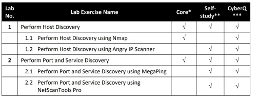

![[img_01.png]]

![[images/img_1.png]]
# NetBIOS Enumeration using Windows CL Utilities

## we are attacking metasploitable 2 vm machine using host machine windows 11

## Attacker : Windows 11   192.168.1.65
## Victim : Metasploitable2   192.168.1.90

![[Pasted image 20230614151556.png]]
# nbtstat -a 192.168.1.90
-a diaplays all the netbios table of a remote computer

![[Pasted image 20230614151833.png]]
# nbtstat -c
-c lists contents of the netbios name cache of the remote computer

---
---

# NetBIOS Enumeration using NSE Script

## Attacker : Kali Linux   
## Victim : Metasploitable2   192.168.1.90

![[Pasted image 20230614152949.png]]

# nmap -sV -v --script nbtstat.nse 192.168.1.90

-sv detects the service version
-v (verbose output) includes all hosta and ports in the output